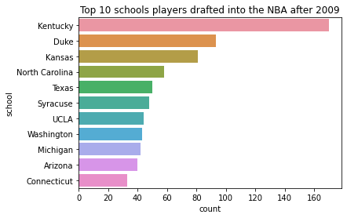
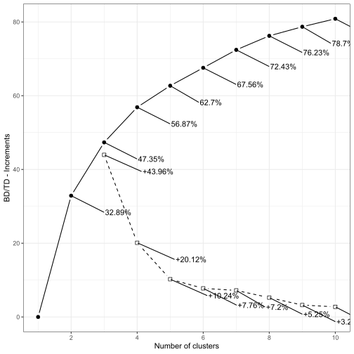
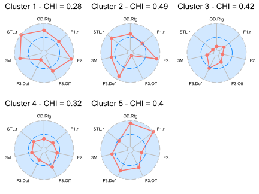
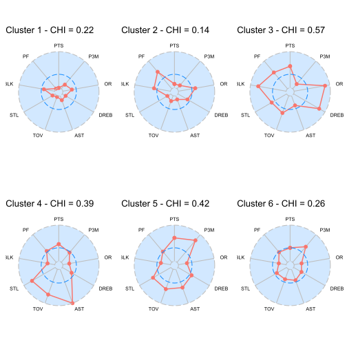
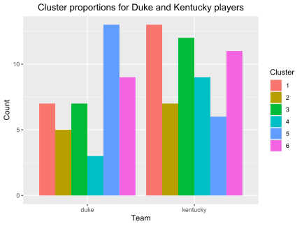

# NCAA Basketball Team and Player Clustering

> The aim of this project is to identify the best NCAA teams in the past decade that produce the most talent in the NBA draft. From there, I analyze the top 30 NCAA basketball teams drafted from in the past decade, aggregate the data over 10 seasons, and cluster teams together using K-means clustering according to the Four Factors, 3-pointers made, and steals ratio. 
>
> While clustering teams is interesting, one should examine the most successful basketball programs. I chose to cluster players over the past decade from the top 2 schools, Duke and Kentucky. Rather than use K-means clustering, I opted to use hierarchical clustering because it generally resulted in less within-cluster heterogeneity, that is how similar players in a specific cluster are to one another. A practical example would be like grouping a point guard in a cluster with centers, who can have vastly different playstyles and who serve different purposes on the court.

## Data Preparation

> Data is obtained using the Sportsipy package in Python. Inspiration is drawn from a [Kaggle dataset of NBA players](https://www.kaggle.com/justinas/nba-players-data) from 1996-2019. The top 10 teams drafted from is shown below.
>
> Python is solely used for data preparation. For teams, please see the **Data Acquisition - NCAA Teams** notebook. For players, please see the **Data Acquisition - NCAA Players** notebook. For converting both players and teams to a format that the BasketballAnalyzeR package in R can use, please see the **Data Cleaning - Teams and Players** notebook.

## Team Clustering

> I compute the average for each of the 30 NCAA teams across 10 seasons using dplyr and then calculate the offensive and defensive four factors for each team using the BasketballAnalyzeR package. With these four factors as ratios and the addition of 3-pointers made and steals ratio, I determine 5 clusters to be the optimal number of clusters, which explains 62.7% of the variance. The graph below shows the explained variance (solid line) and the number of clusters.
>
> 
>
> We create radial plots to create team profiles for our 5 team clusters, which can be seen in the figure below.
>
> 
>
> Code for this can be found in the file labeled **Team Clustering for the Top 30 NCAA Teams.Rmd**.

## Player Clustering

> Player clustering takes a slightly different approach. Rather than using K-means clustering, I opted to use hierarchical clustering because it results in less within-cluster heterogeneity across groups. Using the same approach as above, I determined the optimal number of clusters to be 6 and produced radial plots for player profiles for players from Duke and Kentucky over the past decade. **Note**: I used player careers and have a minutes played restriction of at least 500 minutes played.
>
> 
>
> Does one specific school produce more players in a specific cluster than others?
>
> 
>
> We can see that Duke produces more talent that can shoot from the perimeter, while Kentucky dominates most of the other clusters.
>
> Code for this can be found in the file labeled **Player Clustering for Duke and Kentucky.Rmd**.

## Conclusions and Limitations

While this project is an interesting foray into comparing university programs, it is limited in its scope of the top 30 NCAA teams and assumes that a team stays consistent across 10 seasons of play. The game of basketball is changing and the game is evolving to include more data behind decisions. A more thorough analysis may involve more teams, more players, and greater exploration into clusters to see if one cluster produces more NCAA talent than others. 

What this analysis does provide is a starting point for basketball scouting departments if their team is focusing on obtaining a certain type of player. For example, if a team is looking for a player that can rebound the ball and score, players in cluster 3 may be a good idea. If a scout has limited time and can only look at 1 team, we can determine that Kentucky usually produces the most players from cluster 3. These insights help teams focus and make better player decisions.